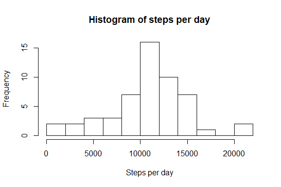
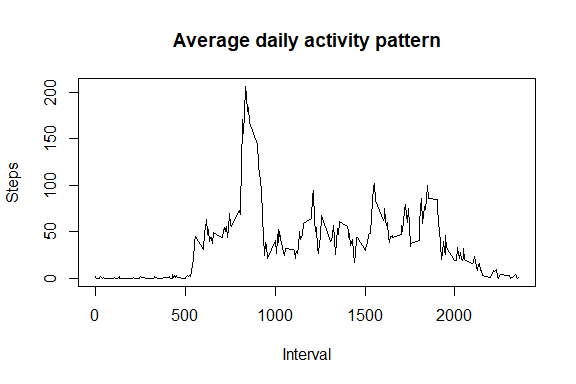
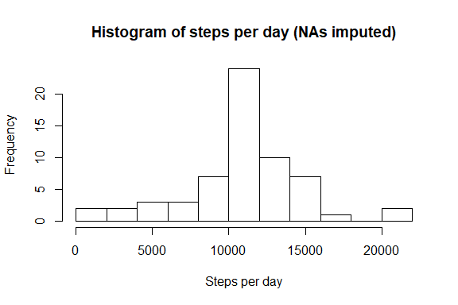
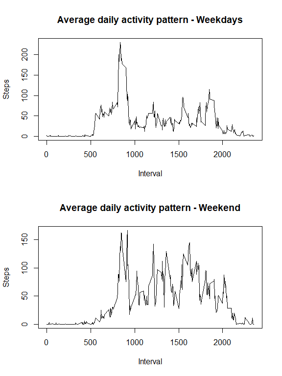

## Loading and preprocessing the data

Download and read file in correct format

```r
download.file("https://d396qusza40orc.cloudfront.net/repdata%2Fdata%2Factivity.zip","activity.zip")
actData <- read.csv(unzip("activity.zip", "activity.csv"), header=TRUE, sep = ",", colClasses = c("numeric", "Date", "integer"))
```

## What is mean total number of steps taken per day?
(As written in this part of the assignment, missing values are ignored for now)

1. Make a histogram of the total number of steps taken each day


```r
# Calculate steps per day
stepsPerDay <- aggregate(x = actData$steps, FUN = sum, by = list(date = actData$date))

# Create histogram of steps per day
hist(stepsPerDay$x,main="Histogram of steps per day",xlab = "Steps per day", breaks = 10)
```

<!-- -->

2. Calculate and report the *mean* and *median* total number of steps taken per day


```r
meanTotalNumberOfSteps <- mean(stepsPerDay$x,na.rm=TRUE)
medianTotalNumberOfSteps <- median(stepsPerDay$x,na.rm=TRUE)
```

The mean is equal to **1.0766189\times 10^{4}** and the median is equal to **1.0765\times 10^{4}**.


## What is the average daily activity pattern?
1. Make a time series plot (i.e. type = "l") of the 5-minute interval (x-axis) and the average number of steps taken, averaged across all days (y-axis)


```r
# Calculating mean of steps per Interval
meanStepsPerInterval <- aggregate(x = actData$steps, FUN = mean, by = list(interval = actData$interval),na.rm=TRUE)

# Plotting average daily activity pattern
plot(meanStepsPerInterval$interval,meanStepsPerInterval$x,type="l",xlab = "Interval", ylab = "Steps", main = "Average daily activity pattern")
```

<!-- -->

2. Which 5-minute interval, on average across all the days in the dataset,
contains the maximum number of steps?


```r
maxInterval <- meanStepsPerInterval$interval[which(meanStepsPerInterval$x==max(meanStepsPerInterval$x))]
```

The interval **835** contains the maximum number of steps - on average across all days.

## Imputing missing values

1. Calculate and report the total number of missing values in the dataset (i.e. the total number of rows with NAs)


```r
sumNAs <- sum(is.na(actData$steps))
```

The total number of missing values in the dataset is **2304**.

2. Devise a strategy for filling in all of the missing values in the dataset. 

We will use the strategy to fill in missing values by using the mean steps of that interval across all days. 

3. Create a new dataset that is equal to the original dataset but with the
missing data filled in.


```r
# Create copy of dataset
actDataImputed <- actData

# Find indices of NAs
indicesOfNas <- which(is.na(actDataImputed$steps))

# Imput NAs by leveraging mean of steps for the interval across all days
for (i in indicesOfNas) {
    meanStepsInThatInterval <- meanStepsPerInterval$x[which(meanStepsPerInterval$interval == actDataImputed$interval[i])]
    actDataImputed$steps[i] <- meanStepsInThatInterval
}
```

The dataset *actDataImputed* is equal to the original data set, but with NAs imputed.

4. Make a histogram of the total number of steps taken each day and Calculate
and report the mean and median total number of steps taken per day. 


```r
# Calculate steps per day of imputed dataset
stepsPerDayImputed <- aggregate(x = actDataImputed$steps, FUN = sum, by = list(date = actDataImputed$date))

# Plot histogram of steps per day of imputed dataset
hist(stepsPerDayImputed$x,main="Histogram of steps per day (NAs imputed)",xlab = "Steps per day", breaks = 10)
```

<!-- -->

```r
meanStepsPerDayImputed <- mean(stepsPerDayImputed$x,na.rm=TRUE)
medianStepsPerDayImputed <- median(stepsPerDayImputed$x,na.rm=TRUE)
```

The mean of steps per day of the imputed dataset is equal to **1.0766189\times 10^{4}** and the median is equal to **1.0766189\times 10^{4}**.

The mean and median values almost don't differ at all from the estimates of the first part of the assignments.

The impact of imputing missing data on the estimates should usually be very small, as the usual imputing strategies follow the concept of taking estimates across the whole dataset. Hence mean or median estimates shouldn't be affected that much.

## Are there differences in activity patterns between weekdays and weekends?

1. Create a new factor variable in the dataset with two levels - "weekday"
and "weekend" indicating whether a given date is a weekday or weekend
day.


```r
actDataImputed$typeOfDay <- ifelse(as.POSIXlt(actDataImputed$date)$wday %in% c(0,6), 'weekend', 'weekday')
```

2. Make a panel plot containing a time series plot (i.e. type = "l") of the
5-minute interval (x-axis) and the average number of steps taken, averaged
across all weekday days or weekend days (y-axis). The plot should look
something like the following, which was creating using


```r
# Calculate mean steps per interval across all weekdays
meanStepsPerIntervalWeekdays <- aggregate(x = actDataImputed$steps[which(actDataImputed$typeOfDay == "weekday")], FUN = mean, by = list(interval = actDataImputed$interval[which(actDataImputed$typeOfDay == "weekday")]),na.rm=TRUE)

# Calculate mean steps per interval across all weekend days
meanStepsPerIntervalWeekend <- aggregate(x = actDataImputed$steps[which(actDataImputed$typeOfDay == "weekend")], FUN = mean, by = list(interval = actDataImputed$interval[which(actDataImputed$typeOfDay == "weekend")]),na.rm=TRUE)

# Plot panel plot with both average daily activity patterns side by side
par(mfrow=c(2,1))
plot(meanStepsPerIntervalWeekdays$interval,meanStepsPerIntervalWeekdays$x,type="l",xlab = "Interval", ylab = "Steps", main = "Average daily activity pattern - Weekdays")
plot(meanStepsPerIntervalWeekdays$interval,meanStepsPerIntervalWeekend$x,type="l",xlab = "Interval", ylab = "Steps", main = "Average daily activity pattern - Weekend")
```

<!-- -->

The activity pattern differs quite a bit between the weekdays and the weekend. Although the highest activity still happens around the 800 and 900 interval marks, the activity is much higher on the weekends in later intervals of the according average day.
